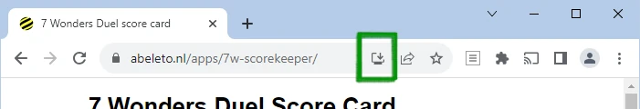

# 7 Wonders Duel Score Card

7 Wonders Duel is a strategy table top game for two players. 

This is a scorecard app for that game. 

I wrote it to teach myself the basics of web front-end framework Vue.

7 Wonders Duel's players go through a pre-termined number of rounds unless one of the players wins either the military or science track. They then tally their scores using the included notepad.

This app aims to be a replacement for that notepad. 

## Usage

Either: 

* Run this app as a website (e.g. on https://example.com/7wd-scoring).
* Run this app as a mobile app by visiting a site with the app on it, then clicking the install button of your mobile browser.

Some browsers display a button that will let you install the app, others will have a menu. 

This is a progressive web app, which means that it is installable.

Once you have installed the app you can run it by clicking its icon.

Fill out the fields, then click Call It to calculate your score.





## Future features

Some added functionality that I plan to include, unless I get bored: 

* Simple checks (e.g. do the military board scores contain values other than 0, 2, 5 or 10.
* A log of previously entered scores.
* Export functions for this log.

## Development

This is based on a project template using [Vite](https://vitejs.dev/) generated by the [Vue Playground](https://play.vuejs.org). It requires [Node.js](https://nodejs.org) v12+. It also uses the [Vite-PWA](https://vite-pwa-org.netlify.app/) plugin.

To start:

```sh
npm install
npm run dev

# if using yarn:
yarn
yarn dev
```
